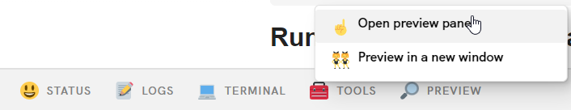
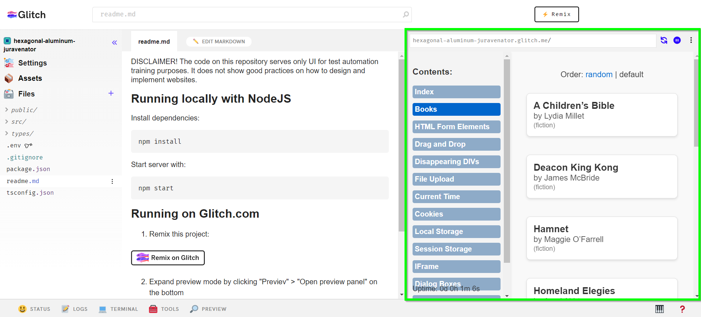

DISCLAIMER! The code on this repository serves only UI for test automation training purposes. It does not show good practices on how to design and implement websites.

# Running locally with NodeJS

Install dependencies:
```
npm install
```

Start server with:
```
npm start
```

# Running on Glitch.com

1) Remix this project:

[](https://glitch.com/edit/#!/import/github/ppnowak/training-ui-server)

2) Expand preview mode by clicking "Previev" > "Open preview panel" on the bottom



3) Wait for application to install and run

